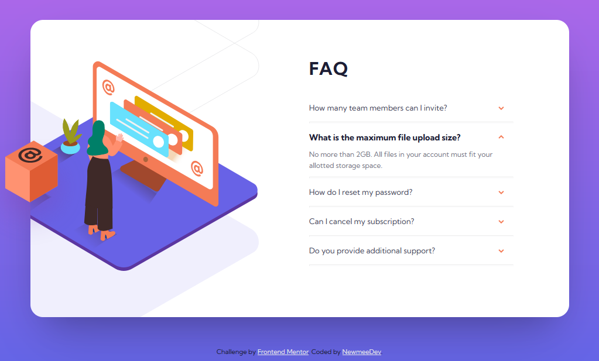

# Frontend Mentor - FAQ accordion card solution

This is a solution to the [FAQ accordion card challenge on Frontend Mentor](https://www.frontendmentor.io/challenges/faq-accordion-card-XlyjD0Oam). Frontend Mentor challenges help you improve your coding skills by building realistic projects. 

### Screenshot



### Built with

- Flexbox
- Media Queries
- JavaScript DOM
- Multiple Background Images
- Image Transformation
- CSS Animations

### What I learned

- Using CSS Flexbox
- Using Media Queries
- Add Elements to the DOM via JavaScript
- Place different Images via JS depending on the screen width
- Positioning of multiple Background Images
- Build an Accordion with CSS only


### Code snippets

```css
/* media querie for extra small devices (phones, 620px and down) */
@media only screen and (max-width: 620px) {
  /* ... */
}


/* the CSS for the accordion */
label {
    color: var(--very-dark-grayish-blue);
    display: block;
    font-size: 1.1em; 
    padding: 9px 0;
    margin: 0 0 1px 0;
    cursor: pointer;
    position: relative;
}

label::after {
	content: "";
	position: absolute;
	background: url('images/icon-arrow-down.svg') no-repeat;
	width: 10px;
	height: 10px;
	right: 16px;
	top: 15px;
}

input:checked + label::after {
	content: "";
	position: absolute;
	background: url('images/icon-arrow-down.svg') no-repeat;
	width: 10px;
	height: 10px;
	right: 16px;
	top: 10px;
	transform: rotate(180deg);
}

label:hover {
	color: var(--soft-red);
    font-weight: bold;
}

input + label + .content {
	opacity: 0;
	height: 0;
	font-size: 0;
	padding: 0;
	transition: ease .5s;
}

input:checked + label + .content {
    font-size: 1em;
	opacity: 1;
    line-height: 1.6em;
    display: inline;
}

input:checked + label	 {
	font-weight: bold;
    font-size: 1.2em;
    color: var(--very-dark-desaturated-blue);
}
```

```js
/////////////////////////////////////////////////////////////////////
// this is the script-part for the responsive illustration layouts //
/////////////////////////////////////////////////////////////////////

// define some variables
let isDesktopActive = false;
let switchWidth = 1020;

// first check if desktop layout is active
if (window.innerWidth >= switchWidth) {
  isDesktopActive = true;
}

// add an event listener for resizing the page which calls the function switchLayout()
window.addEventListener('resize', switchLayout); 

// create the DOM element constants
const card__spacer = document.querySelector('.card__spacer');
const illustration = document.querySelector('.illustration');

// if first page call is in mobile view then call setMobileLayout()
if (!isDesktopActive && window.innerWidth < switchWidth) {
    setMobileLayout(card__spacer, illustration);
}

// then always check every resizings of the page and call the correct layout function
function switchLayout() {
  if (isDesktopActive && window.innerWidth < switchWidth) {
    isDesktopActive = false;
    setMobileLayout(card__spacer, illustration);
  }
  else if (!isDesktopActive && window.innerWidth >= switchWidth) {
    isDesktopActive = true;
    setDesktopLayout(card__spacer, illustration);        
  }
}

// set the image source for desktop design
function setDesktopLayout(cs, img) {
  img.setAttribute('src', 'images/illustration-box-desktop.svg');
}

// set the image source for mobile design
function setMobileLayout(cs, img) { 
  img.setAttribute('src', 'images/illustration-woman-online-mobile.svg');
};
```